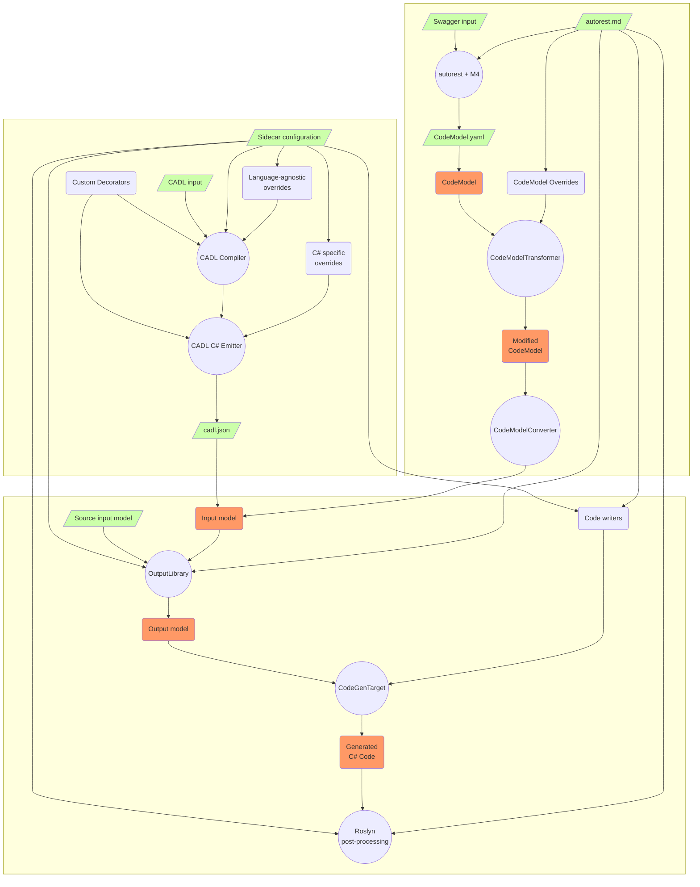

```mermaid
flowchart TB
    subgraph G1 [ ]
      C02(Custom Decorators) --> C10 & C20
      C00[/CADL input/]:::input --> C10
      C01[/Sidecar configuration/]:::input --> C10 & C11 & C21
      C10((CADL Compiler)) --> C20
      C11(Language-agnostic\noverrides) --> C10
      C20((CADL C# Emitter)) --> C30
      C21(C# specific\noverrides) --> C20
    end
    C30[/cadl.json/]:::input --> C40
    C01 --> C50 & C61 & C90
    subgraph G3 [ ]
      C41[/Source input model/]:::input --> C50
      C40(Input model):::data --> C50
      C50((OutputLibrary)) --> C60
      C60(Output model):::data --> C70
      C61(Code writers) --> C70
      C70((CodeGenTarget)) --> C80
      C80(Generated\nC# Code):::data ---> C90
      C90((Roslyn\npost-processing))
    end
    subgraph G2 [ ]
      S00[/Swagger input/]:::input --> S10
      S02[/autorest.md/]:::input --> S10
      S10((autorest + M4)) --> S30
      S40(CodeModel):::data --> S50
      S02 --> S41(CodeModel Overrides) -->  S50
      S50((CodeModelTransformer))--> S60
      S60(Modified\nCodeModel):::data --> S70
      S70((CodeModelConverter)) --> C40
    end
    S02 --> C50 & C61 & C90
    S30[/CodeModel.yaml/]:::input --> S40

    classDef input fill:#cfa;
    classDef data fill:#f96;
```
