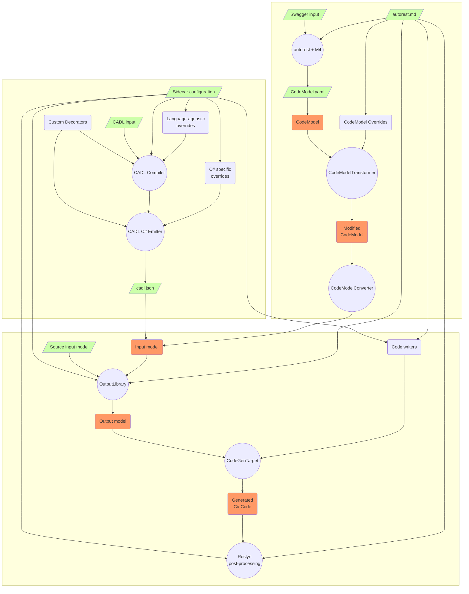

# Design of CADL Support

## Basic Terms
- CADL pipeline: the process and components of C# code generation from REST API specification written in [CADL](https://github.com/microsoft/cadl)
- Swagger pipeline: the process and components of C# code generation from cloud services API specification written in [OpenAPI](https://swagger.io/) 
- generator: autorest.csharp per se, last part of both pipelines that is directly responsible for code generation 
- generator input: file or stream with input for autorest.csharp, produced by previous part in the pipeline
- CADL C# Emitter: part of the CADL pipeline. Emitters are used by CADL compiler to output result of its work.
- CodeModel.yaml: generator input in Swagger pipeline
- CodeModel: deserialized object representation of CodeModel.yaml in autorest.csharp
- cadl.json: generator input in CADL pipeline produced by CADL emitter
- InputModel: deserialized object representation of cadl.json in autorest.csharp

## CADL Pipeline Overview

C# code generation CADL pipeline consists of two major components: CADL compiler that inputs API specification and outputs cadl.json using [CADL C# Emitter](https://github.com/Azure/autorest.csharp/tree/feature/v3/src/CADL.Extension/Emitter.Csharp), and autorest.csharp (a.k.a [generator](https://github.com/Azure/autorest.csharp/tree/feature/v3/src/AutoRest.CSharp)) that inputs cadl.json and outputs C# files that contain cloud service clients and models. cadl.json doesn't have explicit specification. Instead, it is assumed that InputModel types defined in [TS](https://github.com/Azure/autorest.csharp/tree/feature/v3/src/CADL.Extension/Emitter.Csharp/src/type) and in [C#](https://github.com/Azure/autorest.csharp/tree/feature/v3/src/AutoRest.CSharp/Common/Input) match each other. 

## Unification of CADL and Swagger pipelines

In Swagger pipeline, generator input is defined by [CodeModel specification](https://github.com/Azure/autorest/blob/main/packages/libs/codemodel/.resources/all-in-one/json/code-model.json) and is written in YAML. 

