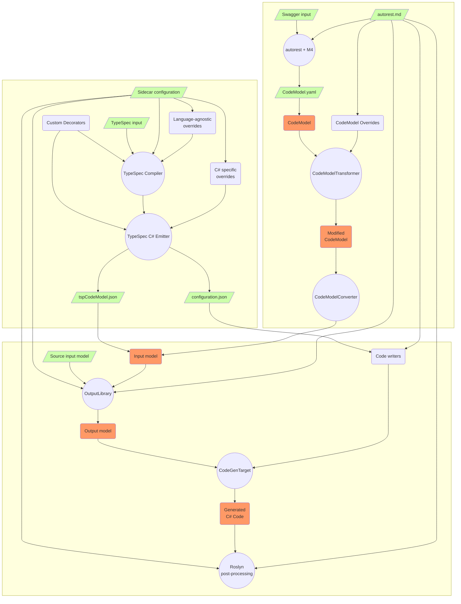

# Design of TypeSpec Support

## Basic Terms
- TypeSpec pipeline: the process and components of C# code generation from cloud services API specification written in [TypeSpec](https://github.com/microsoft/typespec).
- Swagger pipeline: the process and components of C# code generation from REST API specification written in [OpenAPI](https://swagger.io/).
- generator: autorest.csharp per se, last part of both pipelines that is directly responsible for code generation.
- generator input: file or stream with input for autorest.csharp, produced by previous part in the pipeline.
- TypeSpec C# Emitter: part of the TypeSpec pipeline. Emitters are used by TypeSpec compiler to output result of its work.
- CodeModel.yaml: generator input in Swagger pipeline.
- CodeModel: deserialized object representation of CodeModel.yaml in autorest.csharp.
- tspCodeModel.json: generator input in TypeSpec pipeline produced by TypeSpec emitter.
- InputModel: deserialized object representation of tspCodeModel.json in autorest.csharp.
- OutputModel: variety of objects and object factories used by code writers to generate C# code.

## TypeSpec Pipeline Overview

C# code generation TypeSpec pipeline consists of two major components: TypeSpec compiler that inputs API specification and outputs tspCodeModel.json using [TypeSpec C# Emitter](https://github.com/Azure/autorest.csharp/tree/feature/v3/src/TypeSpec.Extension/Emitter.Csharp), and autorest.csharp (a.k.a [generator](https://github.com/Azure/autorest.csharp/tree/feature/v3/src/AutoRest.CSharp)), executed in standalone mode, which inputs tspCodeModel.json and outputs C# files that contain  clients and models for interaction with cloud service.

## TypeSpec C# Emitter
Emitter generates tspCodeModel.json from subset of TypeSpec compiler output object graph. Resulting output is a standard JSON file with circular references support. It doesn't have explicit specification. Instead, it is assumed that InputModel types defined in [TS](https://github.com/Azure/autorest.csharp/tree/feature/v3/src/TypeSpec.Extension/Emitter.Csharp/src/type) and in [C#](https://github.com/Azure/autorest.csharp/tree/feature/v3/src/AutoRest.CSharp/Common/Input) match each other. When new features in generator require InputModel types to be modified or extended, there is no backwards compatibility requirement. Hence, releases of autorest.csharp and TypeSpec C# Emitter must be synchronized so that autorest.csharp can deserialize `tspCodeModel.json` produced by emitter without errors.

Emitter can apply C#-specific transformations and generation rules to the spec before or in process of tspCodeModel.json generation (language-agnostic transformations and rules are expected to be applied to spec before it becomes available to the emitter).

## InputModel vs OutputModel

To represent tspCodeModel.json in memory, generator deserializes JSON into InputModel object graph. Then, with respect of configuration settings and customizations extracted from partial types and assembly level attributes (via `SourceInputModel`), generator creates OutputModel object graph. Various entities from OutputModel will be used by code writers to generate C# files. 

InputModel is a slim, unvalidated representation of the tspCodeModel.json in memory. OutputModel is a rich, self-consistent set of objects that has all the data code writers need to generate valid C# code.

With the exception of enums, no object should belong to InputModel and OutputModel at the same time.

#### InputModel requirements
- Minimalistic design. Only nessesary data is available, data duplication should be avoided (e.g. `InputModelType.DiscriminatorPropertyName` makes `InputModelProperty.IsDiscriminator` unnessesary). 
- All InputModel objects are init-immutable (instance can't be modified after becoming accessible to external code).
- InputModel is final. All decorator-based and configuration-based transformations and rules must be applied in emitter.
- Lazy initializations must be avoided.

#### OutputModel requirements
- Rich design. Same data can be accessable and represented in multiple ways, depending on the needs of code writers (e.g. `ModelTypeProvider` and `JsonObjectSerialization` represent the same data for different code writers).
- OutputModel parts can be created conditionaly and on demand. However, on-demand instantiation should be explicit, lazy initialization must be avoided (e.g. `LowLevelClient` has `CreateSerialization()` method rather than `Serialization` property).
- Sufficient. OutputModel objects should have no properties or methods that return InputModel objects.
- Decoupled from code writers. OutputModel object should not assume (explicitly or implicitly) what kind of writer is going to use it (e.g. protocol methods can be generated for both DPG clients and HLC Rest clients).

## Unification of TypeSpec and Swagger pipelines

In Swagger pipeline, generator input is defined by [CodeModel specification](https://github.com/Azure/autorest/blob/main/packages/libs/codemodel/.resources/all-in-one/json/code-model.json). CodeModel.yaml itself is written in YAML. CodeModel types are over-complicated yet they aren't good enough to represent some schemas that can be defined in TypeSpec. To share generation logic and types between Swagger pipeline and TypeSpec pipeline, CodeModel object graph is transformed into InputModel object graph by `CodeModelConverter`. 

#### Unification requirements

- InputModel is sufficient. Its objects should have no properties or methods that return CodeModel objects. CodeModel-only parts of InputModel must have meaningful default values for TypeSpec pipeline.  
- All CodeModel rules and transformations must be applied before `CodeModelConverter` is invoked.

## TypeSpec + Swagger pipeline diagram

