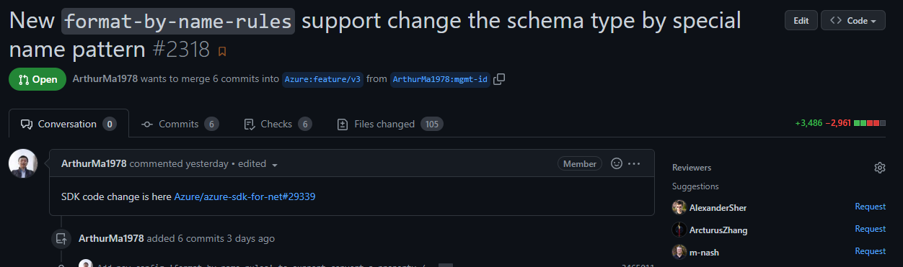
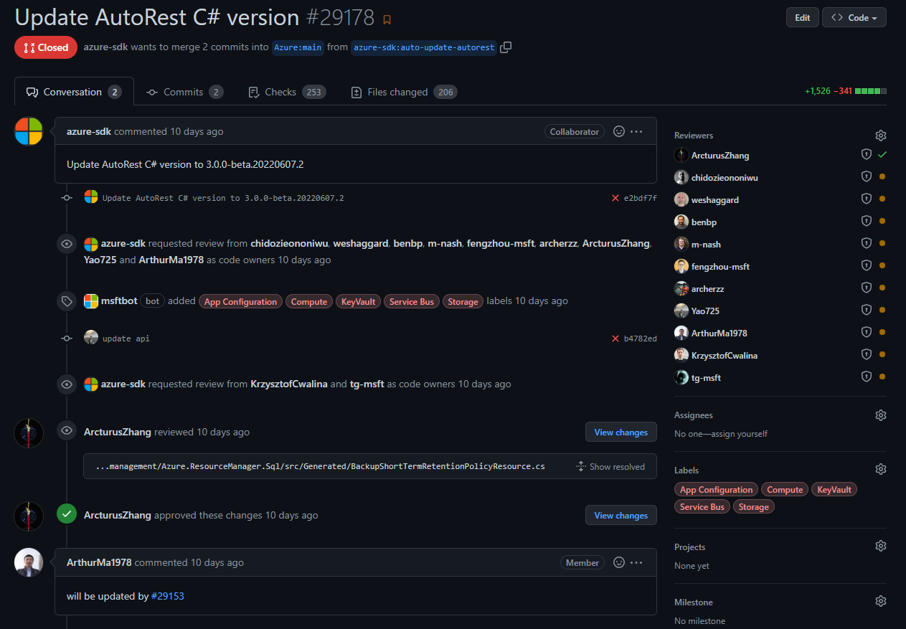

#### Default `autorest --csharp` generator change
___

:warning: We have updated the default generator used by `autorest --csharp` to the new version `V3`, which uses `@autorest/csharp` package and it will have few side effects:
   - It will generate code based on the [.NET SDK guidelines](https://azure.github.io/azure-sdk/dotnet_introduction.html), which will be totally different than the code generated by `V2` version.
   - The dotnet core runtime 3.1+ is required.
   - If you still want to generate code based on `V2` version, you can add `--legacy` flag to the command line to get the previous behavior.
___


# C# code generator for AutoRest V3

- [C# code generator for AutoRest V3](#c-code-generator-for-autorest-v3)
  - [Prerequisites](#prerequisites)
  - [Build](#build)
  - [Test](#test)
    - [Testing Details](#testing-details)
    - [Validate generator changes against Azure SDK before merging your autorest.csharp PR](#validate-generator-changes-against-azure-sdk-before-merging-your-autorestcsharp-pr)
  - [Use in `azure-sdk-for-net` repo](#use-in-azure-sdk-for-net-repo)
    - [PR Integration with Azure SDK Repository](#pr-integration-with-azure-sdk-repository)
  - [Use outside of the `azure-sdk-for-net` repo](#use-outside-of-the-azure-sdk-for-net-repo)
  - [Debugging](#debugging)
  - [Debugging transforms](#debugging-transforms)
  - [Customizing the generated code](#customizing-the-generated-code)
    - [Make a model internal](#make-a-model-internal)
    - [Rename a model class](#rename-a-model-class)
    - [Change a model or client namespace](#change-a-model-or-client-namespace)
    - [Make model property internal](#make-model-property-internal)
    - [Rename a model property](#rename-a-model-property)
    - [Change a model property type](#change-a-model-property-type)
    - [Preserve raw Json value of a property](#preserve-raw-json-value-of-a-property)
    - [Changing member doc comment](#changing-member-doc-comment)
    - [Customize serialization/deserialization methods](#customize-serializationdeserialization-methods)
    - [Renaming an enum](#renaming-an-enum)
    - [Renaming an enum member](#renaming-an-enum-member)
    - [Changing an enum to an extensible enum](#changing-an-enum-to-an-extensible-enum)
    - [Make a client internal](#make-a-client-internal)
    - [Rename a client](#rename-a-client)
    - [Replace any generated member](#replace-any-generated-member)
    - [Remove any generated member](#remove-any-generated-member)
    - [Change model namespace or accessibility in bulk](#change-model-namespace-or-accessibility-in-bulk)
    - [Change operation accessibility in bulk](#change-operation-accessibility-in-bulk)
    - [Exclude models from namespace](#exclude-models-from-namespace)
    - [Extending a model with additional constructors](#extending-a-model-with-additional-constructors)
  - [Management plane concepts and configurations](#management-plane-concepts-and-configurations)

<!-- /TOC -->

## Prerequisites

- [NodeJS (14.x.x)](https://nodejs.org/en/) 
- [.NET Core SDK (5.0.100)](https://dotnet.microsoft.com/download/dotnet-core/5.0)
- [PowerShell Core 7](https://github.com/PowerShell/PowerShell/releases/latest)
- `npm install` (at root)

## Build

- `dotnet build` (at root)

## Test

**`./eng/Generate.ps1` (at root in PowerShell Core)**

This command tests your change across many swagger definitions and samples.

These arguments change the behavior:
- `-fast` option skips Swagger -> YAML IL step. Much faster when only making codegen changes
- `-fast SWAGGER_NAME` (where SWAGGER_NAME is replaced with the name of the swagger) to run only one case

**`dotnet test` (at root)**

### Testing Details

[autorest.testserver](http://github.com/Azure/autorest.testserver/) provides a platform for automated testing of the code generators. 

It packages a bunch of test swagger files, along with a “mock” nodejs server. 

The swagger files are compiled, and then run, which pings the mock server (to verify behavior). This tests both the Modeler 4 and language specific codegen. 

This document contains some additional [technical details](https://github.com/Azure/autorest.csharp/blob/feature/v3/test/README.md).

### Validate generator changes against Azure SDK before merging your autorest.csharp PR

When the automatic PR is created for azure-sdk-for-net if there are any issues found all other changes to autorest.csharp are blocked until those issues are resolved.  This means we should be certain that the changes we are making create the expected result in azure-sdk-for-net prior to merging our PR. 

#### Automatical steps

Go to [Autorest Regen Preview](https://dev.azure.com/azure-sdk/internal/_build?definitionId=5990&_a=summary) pipeline, and click "Run Pipeline". In "Branch/tag", type in your PR ref, i.e. refs/pull/3215/head, or refs/pull/3215/merge. Click "Run". After the build finishes, there will be a PR starting with "Autorest Regen Preview".

#### Manual steps

You could do these manually.

- Run `dotnet pack /p:OfficialBuildId=yyyyMMdd.100` at the root directory of this repository to package up a version of the generator
  - Since there can be real versions with the same date starting at `.100` can ensure no conflicts with official builds.
  - This will place a nupkg file at this location `[RepoRoot]\artifacts\packages\Debug`
- Edit the nuget configuration file [here](https://github.com/Azure/azure-sdk-for-net/blob/main/NuGet.Config) to have a new source `<add key="DEBUG" value="[RepoRoot]\artifacts\packages\Debug" />`
  - This is not intended to be checked in but is a temporary change so `dotnet restore` can find the package
- Update the [Packages.Data.props](https://github.com/Azure/azure-sdk-for-net/blob/main/eng/Packages.Data.props#L156) file to have Microsoft.Azure.AutoRest.Csharp use the new local version you created in step 1
  - This is not intended to be checked in but is a temporary change so `dotnet restore` can find the package
- If your generator PR needs to apply to typespec/cadl projects, or your generator PR changes anything in our emitter (the `src\CADL.Extension\Emitter.Csharp` project), you will need to
  1. Update the `version` in `src\CADL.Extension\Emitter.Csharp\package.json`
  2. Run `npm pack` command in `src\CADL.Extension\Emitter.Csharp` directory. This will produce a pack like `src\CADL.Extension\Emitter.Csharp\azure-tools-typespec-csharp-x.y.z.tgz` where `x.y.z` is the version number you set in step 1.
  3. Change the emitter version used in our `azure-sdk-for-net` repo in this file `eng\emitter-package.json` like this:
  ```diff
  {
    "main": "dist/src/index.js",
    "dependencies": {
  -   "@azure-tools/typespec-csharp": "0.1.11-beta.20230212.4"
  +   "@azure-tools/typespec-csharp": "/absolute/path/to/src/CADL.Extension/Emitter.Csharp/azure-tools-typespec-csharp-x.y.z.tgz"
    }
  }
  ```
  4. Locate the `dll` file generated for the generator, usually it could be found `autorest.csharp` repository in this directory: `artifacts\bin\AutoRest.CSharp\Debug\net6.0\AutoRest.CSharp.dll`
- At this point there are several ways to generate but the idea is to generate and test all projects that will be affected by your PR.  There are tools such as [this](https://github.com/ArcturusZhang/Regen) which are written to handle specific cases.  If you are unsure you should run against all projects to be safe.

To regen and test everything in azure-sdk-for-net after you have updated to use your new local build do the following:

- First generate all projects in the repo by executing `dotnet build [RepoRoot]/eng/service.proj /t:GenerateCode`. If your generator PR needs to apply to typespec/cadl projects, or your generator PR changes anything in our emitter (the `src\CADL.Extension\Emitter.Csharp` project), you will need to run `dotnet build [RepoRoot]/eng/service.proj /t:GenerateCode  /p:typespecAdditionalOptions="csharpGeneratorPath=/absolute/path/to/artifacts/bin/AutoRest.CSharp/Debug/net6.0/AutoRest.CSharp.dll`.
- Next we want to at minimum run the tests against the new generated code by using `dotnet test [RepoRoot]/eng/service.proj --filter "(TestCategory!=Manually) & (TestCategory!=Live)"`
- For non GA libraries there could be API changes so we want to run the Export-API script with no parameters which will update any projects that now have an API change `[RepoRoot]\eng\scripts\Export-API.ps1`
- Finally it is very possible that we will need to make test case changes or snippet changes especially for non GA libraries which have expected changes.  All of these should be made in the branch and included in the PR to demonstrate all resulting changes from the autorest.csharp PR.

Once all of that is successful, we can commit all of the local changes except the NuGet file and `Packages.Data.props` and push those to a branch.  Once this is done we want to ensure this regen PR is discoverable as well as the key stakeholders who would need to sign off mark this PR as either approved or request changes.

- In the autorest.csharp PR description please add a line at the very top indicating which azure-sdk-for-net PR is the regeneration for this PR.  An example would look like this

- Next have any stakeholders that would need to review do so in this PR and mark it as approved or request changes.
- Once all stakeholders review and approve of the PR we are ready for the next step of merging the autorest.csharp PR.

When the autorest.csharp PR gets merged there will be an automatic azure-sdk-for-net PR created under the [azure-sdk fork](https://github.com/azure-sdk/azure-sdk-for-net) but this PR will not contain any of the Export-API changes nor will it contain any custom changes to fix test cases / snippet references.  It is therefore recommended that we merge this PR into our custom PR we made to validate there are no additional changes we didn't expect.

- Undo the changes to the nuget config and Packages.Data.props if you have not already done so.
- Add a note in the autogenerated PR that conflicts are being resolved in PR you created above so that people know where to follow the conversation.

- If you haven't done so add azure-sdk as an upstream and pull the branch that the automatic PR uses `auto-update-autorest` into your local azure-sdk-for-net branch.
  - `git remote add azure-sdk https://github.com/azure-sdk/azure-sdk-for-net`
  - `git fetch azure-sdk`
  - `git pull azure-sdk auto-update-autorest`
- This should have zero conflicts and if it does something wasn't done correctly in the PR that was created to demonstrate the regeneration.
  - If there are conflicts our only option here is to resolve them, but will most require another review from the stakeholders most likely.
- If there were no conflicts or after they are resolved push the changes to your branch and you can then merge the PR that was previous approved or re-approved in the case of conflicts.
- The autogenerated PR can now simply be closed

## Use in `azure-sdk-for-net` repo

Run `dotnet build /t:GenerateCode` in the directory that contains your `.csproj` file.

This executes [these targets](https://github.com/Azure/autorest.csharp/blob/feature/v3/src/AutoRest.CSharp/build/CodeGeneration.targets).

Refer also to [azure-sdk-for-net/CONTRIBUTING.md](https://github.com/Azure/azure-sdk-for-net/blob/master/CONTRIBUTING.md#on-boarding-new-generated-code-library) for more details.

### PR Integration with Azure SDK Repository

Merging a change in autorest.csharp will open a PR against azure-sdk-for-net with every project’s generated code staged for review.

Along with this, it also bumps the generator to the new version. 

This bump is done [here](https://github.com/Azure/azure-sdk-for-net/blob/master/eng/Packages.Data.props).

The generator is shipped as a NuGet package. 

This way, every binding stays in lockstep with the current generator


## Use outside of the `azure-sdk-for-net` repo

Use below command to generate code:

 ```
 autorest --use:@autorest/csharp@3.0.0-beta.20210210.4 --input-file:FILENAME  --clear-output-folder:true --output-folder:DIRECTORY
 ```

Note: 
1. Use @autorest/csharp version v3.0.0-beta.20210210.4 or later.
2. If you don't want to override the `.csproj` after the first generation, you can pass `--skip-csproj` flag with the autorest command.

For more details please refer [these](https://github.com/Azure/autorest/tree/master/docs/generate) docs to generate code from your OpenAPI definition using AutoRest.

## Debugging 

There are two entry points for debugging autorest.csharp:

- Opening AutoRest.CSharp.sln in Visual Studio will contain a debugging profile for each sample and test. These only run the "back half", using the yaml file generated by autorest.core as input.
- ./Generate.ps1 will execute the entire pipeline by invoking autorest and including autorest.csharp as a plugin. Add:

```
csharpgen:
  attach: true
```

to the autorest configuration to attach a debugger to the plugin process.

## Debugging transforms

Many customizations can be done as a transform in readme.md, however getting it right can be tricky.

One useful trick is to use `$lib.log` to output the state of the object either before of after transform:

```
  transform: >
    $['x-accessibility'] = "internal";
    $lib.log($);
```

## Customizing the generated code

### Make a model internal

Define a class with the same namespace and name as generated model and use the desired accessibility.

<details>

**Generated code before (Generated/Models/Model.cs):**

``` C#
namespace Azure.Service.Models
{
    public partial class Model { }
}
```

**Add customized model (Model.cs)**

``` C#
namespace Azure.Service.Models
{
    internal partial class Model { }
}
```

**Generated code after (Generated/Models/Model.cs):**

``` diff
namespace Azure.Service.Models
{
-    public partial class Model { }
+    internal partial class Model { }
}
```

</details>

### Rename a model class

Define a class with a desired name and mark it with `[CodeGenModel("OriginalName")]`

<details>

**Generated code before (Generated/Models/Model.cs):**

``` C#
namespace Azure.Service.Models
{
    public partial class Model { }
}
```

**Add customized model (NewModelClassName.cs)**

``` C#
namespace Azure.Service.Models
{
    [CodeGenModel("Model")]
    public partial class NewModelClassName { }
}
```

**Generated code after (Generated/Models/NewModelClassName.cs):**

``` diff
namespace Azure.Service.Models
{
-    public partial class Model { }
+    public partial class NewModelClassName { }
}
```

</details>

### Change a model or client namespace

Define a class with a desired namespace and mark it with `[CodeGenModel("OriginalName")]`.

The same works for a client, if marked with `[CodeGenClient("ClientName")]`.

<details>

**Generated code before (Generated/Models/Model.cs):**

``` C#
namespace Azure.Service.Models
{
    public partial class Model { }
}
```

**Add customized model (NewModelClassName.cs)**

``` C#
namespace Azure.Service
{
    [CodeGenModel("Model")]
    public partial class Model { }
}
```

**Generated code after (Generated/Models/NewModelClassName.cs):**

``` diff
- namespace Azure.Service.Models
+ namespace Azure.Service
{
    public partial class Model { }
}
```

</details>

### Make model property internal

Define a class with a property matching a generated property name but with desired accessibility.

<details>

**Generated code before (Generated/Models/Model.cs):**

``` C#
namespace Azure.Service.Models
{
    public partial class Model
    {
        public string Property { get; }
    }
}
```

**Add customized model (Model.cs)**

``` C#
namespace Azure.Service.Models
{
    public partial class Model
    {
        internal string Property { get; } 
    }
}
```

**Generated code after (Generated/Models/Model.cs):**

``` diff
namespace Azure.Service.Models
{
    public partial class Model
    {
-        public string Property { get; }
    }
}
```

</details>

### Rename a model property

Define a partial class with a new property name and mark it with `[CodeGenMember("OriginalName")]` attribute.

**NOTE:** you can also change a property to a field using this mapping.

<details>

**Generated code before (Generated/Models/Model.cs):**

``` C#
namespace Azure.Service.Models
{
    public partial class Model
    {
        public string Property { get; }
    }
}
```

**Add customized model (Model.cs)**

``` C#
namespace Azure.Service.Models
{
    public partial class Model
    {
        [CodeGenMember("Property")]
        public string RenamedProperty { get; } 
    }
}
```

**Generated code after (Generated/Models/Model.cs):**

``` diff
namespace Azure.Service.Models
{
    public partial class Model
    {
-        public string Property { get; }
+        // All original Property usages would reference a RenamedProperty
    }
}
```

</details>

### Change a model property type

:warning:

**NOTE: This is supported for a narrow set of cases where the underlying serialized type doesn't change**

Scenarios that would work:

1. String <-> TimeSpan (both represented as string in JSON)
2. Float <-> Int (both are numbers)
3. String <-> Enums (both strings) 
4. String -> Uri

Won't work:

1. String <-> Bool (different json type)
2. Changing model kinds

If you think you have a valid re-mapping scenario that's not supported file an issue.

:warning:

Define a property with different type than the generated one.

<details>

**Generated code before (Generated/Models/Model.cs):**

``` C#
namespace Azure.Service.Models
{
    public partial class Model
    {
        public string Property { get; }
    }
}
```

**Add customized model (Model.cs)**

``` C#
namespace Azure.Service.Models
{
    public partial class Model
    {
        public DateTime Property { get; }
    }
}
```

**Generated code after (Generated/Models/Model.Serializer.cs):**

``` diff
namespace Azure.Service.Models
{
    public partial class Model
    {
-        public string Property { get; }
+        // Serialization code now reads and writes DateTime value instead of string  
    }
}
```

</details>

### Preserve raw Json value of a property

Use the [Change a model property type](#Change-a-model-property-type) approach to change property type to `JsonElement`.

<details>

**Generated code before (Generated/Models/Model.cs):**

``` C#
namespace Azure.Service.Models
{
    public partial class Model
    {
        public string Property { get; }
    }
}
```

**Add customized model (Model.cs)**

``` C#
namespace Azure.Service.Models
{
    public partial class Model
    {
        public JsonElement Property { get; }
    }
}
```

**Generated code after (Generated/Models/Model.Serializer.cs):**

``` diff
namespace Azure.Service.Models
{
    public partial class Model
    {
-        public string Property { get; }
+        // Serialization code now reads and writes JsonElement value instead of string  
    }
}
```

</details>

### Changing member doc comment

Redefine a member in partial class with a new doc comment.

<details>

**Generated code before (Generated/Models/Model.cs):**

``` C#
namespace Azure.Service.Models
{
    public partial class Model
    {
        /// Subpar doc comment
        public string Property { get; }
    }
}
```

**Add customized model (Model.cs)**

``` C#
namespace Azure.Service.Models
{
    public partial class Model
    {
        /// Great doc comment
        public string Property { get; }
    }
}
```

**Generated code after (Generated/Models/Model.cs):**

``` diff
namespace Azure.Service.Models
{
    public partial class Model
    {
-        /// Subpar doc comment
-        public string Property { get; }  
    }
}
```

</details>

### Customize serialization/deserialization methods

Use the [Replace any generated member](#replace-any-generated-member) approach to replace Serialize/Deserialize method with a custom implementation.

<details>

**Generated code before (Generated/Models/Cat.Serialization.cs):**

``` C#
namespace Azure.Service.Models
{
  public partial class Cat
  {
      internal static Cat DeserializeCat(JsonElement element)
      {
          string color = default;
          string name = default;
          foreach (var property in element.EnumerateObject())
          {
              if (property.NameEquals("color"))
              {
                  if (property.Value.ValueKind == JsonValueKind.Null)
                  {
                      continue;
                  }
                  color = property.Value.GetString();
                  continue;
              }
              if (property.NameEquals("name"))
              {
                  if (property.Value.ValueKind == JsonValueKind.Null)
                  {
                      continue;
                  }
                  name = property.Value.GetString();
                  continue;
              }
          }
          return new Cat(id, name);
      }
  }
}
```

**Add customized model (Cat.cs)**

``` C#
namespace Azure.Service.Models
{
  public partial class Cat
  {
      internal static Cat DeserializeCat(JsonElement element)
      {
          string color = default;
          string name = default;
          foreach (var property in element.EnumerateObject())
          {
              if (property.NameEquals("name"))
              {
                  if (property.Value.ValueKind == JsonValueKind.Null)
                  {
                      continue;
                  }
                  name = property.Value.GetString();
                  continue;
              }
          }
          // WORKAROUND: server never sends color, default to black
          color = "black";
          return new Cat(name, color);
      }
  }
}
```

**Generated code after (Generated/Models/Model.cs):**

Generated code won't contain the DeserializeCat method and the custom one would be used for deserialization.

</details>

### Renaming an enum

Redefine an enum with a new name and all the members mark it with `[CodeGenModel("OriginEnumName")]`.

**NOTE: because enums can't be partial all values have to be copied**

<details>

**Generated code before (Generated/Models/Colors.cs):**

``` C#
namespace Azure.Service.Models
{
    public enum Colors
    {
        Red,
        Green,
        Blue
    }
}
```

**Add customized model (WallColors.cs)**

``` C#
namespace Azure.Service.Models
{
    [CodeGenModel("Colors")]
    public enum WallColors
    {
        Red,
        Green,
        Blue
    }
}
```

**Generated code after (Generated/Models/Model.cs):**

``` diff
-namespace Azure.Service.Models
-{
-    public enum Colors
-    {
-        Red,
-        Green,
-        Blue
-    }
-}
+// Serialization code uses the new WallColors type name
```

</details>

### Renaming an enum member

Redefine an enum with the same name and all the members, mark renamed member with `[CodeGenMember("OriginEnumMemberName")]`.

**NOTE: because enums can't be partial all values have to be copied but only the ones being renamed should be marked with an attributes**

<details>

**Generated code before (Generated/Models/Colors.cs):**

``` C#
namespace Azure.Service.Models
{
    public enum Colors
    {
        Red,
        Green,
        Blue
    }
}
```

**Add customized model (Colors.cs)**

``` C#
namespace Azure.Service.Models
{
    public enum Colors
    {
        Red,
        Green,
        [CodeGenMember("Blue")]
        SkyBlue
    }
}
```

**Generated code after (Generated/Models/Model.cs):**

``` diff
-namespace Azure.Service.Models
-{
-    public enum Colors
-    {
-        Red,
-        Green,
-        Blue
-    }
-}
+// Serialization code uses the new SkyBlue member name
```

</details>

### Changing an enum to an extensible enum

Redefine an enum into an extensible enum by creating an empty struct with the same name as original enum.

<details>

**Generated code before (Generated/Models/Colors.cs):**

``` C#
namespace Azure.Service.Models
{
    public enum Colors
    {
        Red,
        Green
    }
}
```

**Add customized model (Colors.cs)**

``` C#
namespace Azure.Service.Models
{
    public partial struct Colors
    {
    }
}
```

**Generated code after (Generated/Models/Model.cs):**

``` diff
namespace Azure.Service.Models
{
-    public enum Colors
-    {
-        Red,
-        Green
-    }
+    public readonly partial struct Colors : IEquatable<Colors>
+    {
+        private readonly string _value;

+        public Colors(string value)
+        {
+            _value = value ?? throw new ArgumentNullException(nameof(value));
+        }

+        private const string Red = "red";
+        private const string Green = "green";

+        public static Colors Red { get; } = new Colors(Red);
+        public static Colors Green { get; } = new Colors(Green);
+        public static bool operator ==(Colors left, Colors right) => left.Equals(right);
         ...
}
```

</details>

### Make a client internal

Define a class with the same namespace and name as generated client and use the desired accessibility.

<details>

**Generated code before (Generated/Operations/ServiceClient.cs):**

``` C#
namespace Azure.Service.Operations
{
    public partial class ServiceClient { }
}
```

**Add customized model (Model.cs)**

``` C#
namespace Azure.Service.Operations
{
    internal partial class ServiceClient { }
}
```

**Generated code after (Generated/Operations/ServiceClient.cs):**

``` diff
namespace Azure.Service.Operations
{
-    public partial class ServiceClient { }
+    internal partial class ServiceClient { }
}
```

</details>


### Rename a client

Define a partial client class with a new name and mark it with `[CodeGenClient("OriginalName")]`

<details>

**Generated code before (Generated/Operations/ServiceClient.cs):**

``` C#
namespace Azure.Service.Operations
{
    public partial class ServiceClient {}
}
```

**Add customized model (Model.cs)**

``` C#
namespace Azure.Service.Operations
{
    [CodeGenClient("ServiceClient")]
    public partial class TableClient { }
}
```

**Generated code after (Generated/Operations/ServiceClient.cs):**

``` diff
namespace Azure.Service.Operations
{
-    public partial class ServiceClient { }
+    public partial class TableClient { }
}
```

</details>


### Replace any generated member

Works for model and client properties, methods, constructors etc.

Define a partial class with member with the same name and for methods same parameters.

<details>

**Generated code before (Generated/Models/Model.cs):**

``` C#
namespace Azure.Service.Models
{
    public partial class Model
    {
        public Model()
        {  
            Property = "a";
        }

        public string Property { get; set; }
    }
}
```

**Add customized model (Model.cs)**

``` C#
namespace Azure.Service.Models
{
    public partial class Model
    {
        internal Model()
        {
            Property = "b";
        }
    }
}
```

**Generated code after (Generated/Models/Model.cs):**

``` diff
namespace Azure.Service.Models
{
    public partial class Model
    {
-        public Model()
-        {  
-            Property = "a";
-        }
    }
}
```

</details>

### Remove any generated member

Works for model and client properties, methods, constructors etc.

Define a partial class with `[CodeGenSuppress("NameOfMember", typeof(Parameter1Type), typeof(Parameter2Type))]` attribute.

<details>

**Generated code before (Generated/Models/Model.cs):**

``` C#
namespace Azure.Service.Models
{
    public partial class Model
    {
        public Model()
        {  
            Property = "a";
        }

        public Model(string property)
        {  
            Property = property;
        }

        public string Property { get; set; }
    }
}
```

**Add customized model (Model.cs)**

``` C#
namespace Azure.Service.Models
{
    [CodeGenSuppress("Model", typeof(string))]
    public partial class Model
    {
    }
}
```

**Generated code after (Generated/Models/Model.cs):**

``` diff
namespace Azure.Service.Models
{
    public partial class Model
    {
-        public Model(string property)
-        {  
-            Property = property;
-        }
    }
}
```

</details>

### Change model namespace or accessibility in bulk

<details>

**Generated code before:**

``` C#
namespace Azure.Service.Models
{
    public partial class Model1 {}
    public partial class Model2 {}
    public partial class Model3 {}
    public partial class Model4 {}
}
```

**Add autorest.md transformation**

```
directive:
  from: swagger-document
  where: $.definitions.*
  transform: >
    $["x-namespace"] = "Azure.Search.Documents.Indexes.Models"
    $["x-accessibility"] = "internal"
```

**Generated code after:**

``` diff
-namespace Azure.Service.Models
+namespace Azure.Search.Documents.Indexes.Models
{
-    public partial class Model1 {}
+    internal partial class Model1 {}
-    public partial class Model2 {}
+    internal partial class Model2 {}
-    public partial class Model3 {}
+    internal partial class Model3 {}
-    public partial class Model4 {}
+    internal partial class Model4 {}
}
```

</details>

### Change operation accessibility in bulk

<details>

**Generated code before (Generated/Client.cs):**

``` C#
public virtual Response Operation(string body = null, CancellationToken cancellationToken = default)
public virtual async Task<Response> OperationAsync(string body = null, CancellationToken cancellationToken = default)
```

**Add autorest.md transformation**

```
directive:
- from: swagger-document
  where: $..[?(@.operationId=='Operation')]
  transform: >
    $["x-accessibility"] = "internal";
```

**Generated code after (Generated/Client.cs):**

``` C#
internal virtual Response Operation(string body = null, CancellationToken cancellationToken = default)
internal virtual async Task<Response> OperationAsync(string body = null, CancellationToken cancellationToken = default)
```
    
</details>

### Exclude models from namespace

<details>

**Generated code before (Generated/Models/Model.cs):**

``` C#
namespace Azure.Service.Models
{
    public partial class Model { }
}
```

**Add `model-namespace` in autorest.md**

```
model-namespace: false
input-file: "swagger-document"
```

**Generated code after (Generated/Models/Model.cs):**

``` diff
- namespace Azure.Service.Models
+ namespace Azure.Service
{
    public partial class Model { }
}
```
</details>
    
    
### Extending a model with additional constructors    
    
<details>
    
As with most customization, you can define a partial class for Models and extend them with methods and constructors.

**Generated code before (Generated/Models/Model.cs):**

```csharp
namespace Azure.Service.Models
{
    public partial class Model { }
}
```

**Add customized model (Model.cs)**

```csharp
namespace Azure.Service.Models
{
    public partial class Model {
        public Model(int x)
        {
        }
    }
}
```

</details>

<details>
 <summary>Repository-specific pipeline configuration</summary>

```yaml
# autorest-core version
version: 3.9.3
save-inputs: true
use: $(this-folder)/artifacts/bin/AutoRest.CSharp/Debug/net6.0/
clear-output-folder: true
public-clients: true
skip-csproj-packagereference: true
```

</details>

## Management plane concepts and configurations

See the documentation [here](./docs/mgmt/readme.md)
