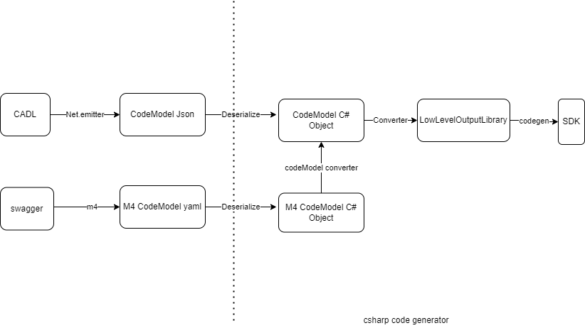
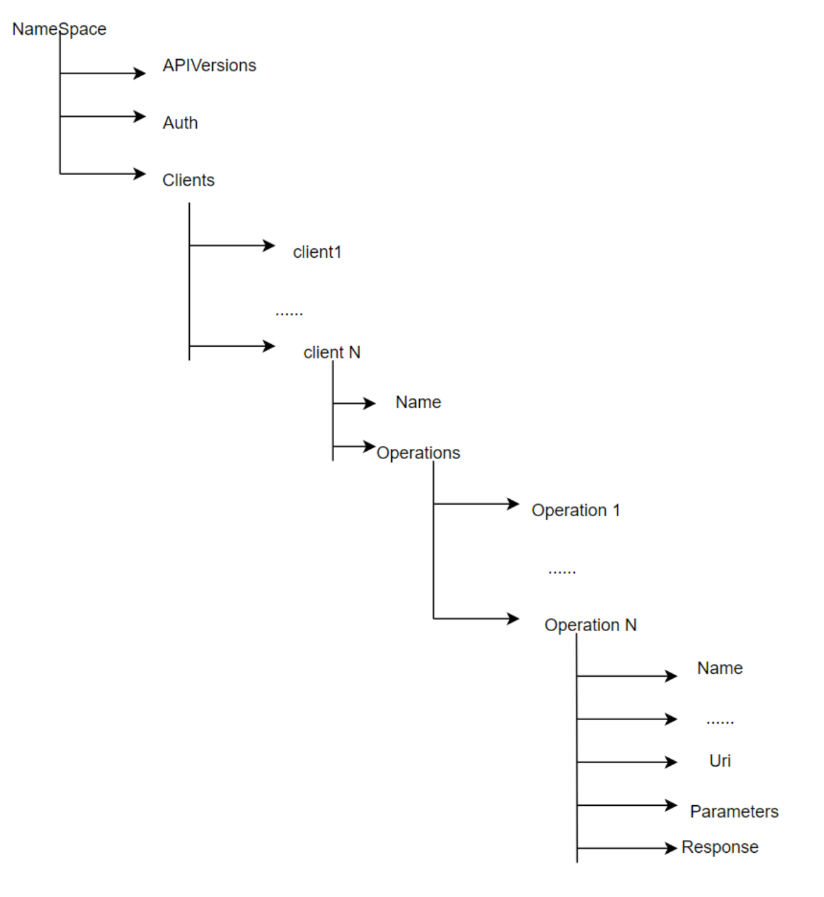

# CADL to .Net

DPG 1.1 requires CADL as input, if service would like to generate models.

## Pipeline

Cadl->net.emitter-> json -> outputLibrary -> sdk



## Components

### csharp emitter

The emitter will emit the cadl model into json file from input CADL file

#### Code Model

code Model:


Parameter:

``` code

string Name,
string NameInRequest,
string? Description,
InputType Type,
RequestLocation Location,
InputConstant? DefaultValue,
VirtualParameter? VirtualParameter,
InputParameter? GroupedBy,
InputOperationParameterKind Kind,
bool IsRequired,
bool IsApiVersion,
bool IsResourceParameter,
bool IsContentType,
bool IsEndpoint,
bool SkipUrlEncoding,
bool Explode,
string? ArraySerializationDelimiter,
string? HeaderCollectionPrefix
```

TypeModel: InputType

```code
string Name
InputTypeKind Kind
bool IsNullable
InputTypeSerializationFormat SerializationFormat
schema
```

#### Map CADL features in Code Model

##### Namespace / interface

Map operations grouped by namespace/interface => client

#### Spread

The spread operator takes the members of a source model and copies them into a target model.

In Code Model, the target model will contain the members of the source model together with its members. There will no relationship between the target model and the source model.

#### Extend

We will add parent relationship in target model.

#### server decorator

Map server to endpoint client parameter.

#### run csharp emitter

cadl compile [--emit <csharp-emitter>] [--output-path <outputDirectory>] <cadl-file-path>

e.g.

```cmd

cadl compile --output-path test\TestProjects\string-format test\TestProjects\string-format\string-format.cadl --emit @cadl-lang/csharp-emitter
```

#### debug

node --inspect-brk node_modules\@cadl-lang\compiler\dist\core\cli.js compile main.cadl

node --inspect-brk node_modules\@cadl-lang\compiler\dist\core\cli.js compile --output-path samples\petStore\ samples\petStore\petstore.cadl --emit @cadl-lang/csharp-emitter

### serialize

CadlSerialization will serialize the cadl json to C# object (json file -> c# codemodel (c# object)).

CalSerialization defines converters to handle special type/model serialization

#### Enum converter

In the json model, the value of the property is the enum variable name, the Enum converter will transfer to the enum value.

### OutputLibrary Constructor
DpgOutputLibraryBuilder will convert c# cadl model to output library for DPG.

### codeModelConvertor

CodeModelConverter will convert modelfoure to the cadl code model (m4 codemodel c# object -> cadl codemodel c# object).

## Generate SDK from CADL

### Generate SDK step by step
You can generate sdk step by step as following: 
- emit cadl model json
  
    ```cmd
    cadl compile --emit @cadl-lang/csharp-emitter <path-to-cadl-file>
    ```

- generate sdk from cadl json
  
  ```cmd

  artifacts\bin\AutoRest.CSharp\Debug\netcoreapp3.1\AutoRest.CSharp.exe --standalone <path-to-cadl-file-directory>
  ```

  e.g.

  ```cmd

  artifacts\bin\AutoRest.CSharp\Debug\netcoreapp3.1\AutoRest.CSharp.exe --standalone test\TestProjectsCadl\petstore
  ```

### Generate SDK by Generate.ps1

You can generate SDK via Generate.ps1 script

```cmd
eng/Generate.ps1 petstore
```

## E2E flow
Integrate autorst.csharp into CADL compile